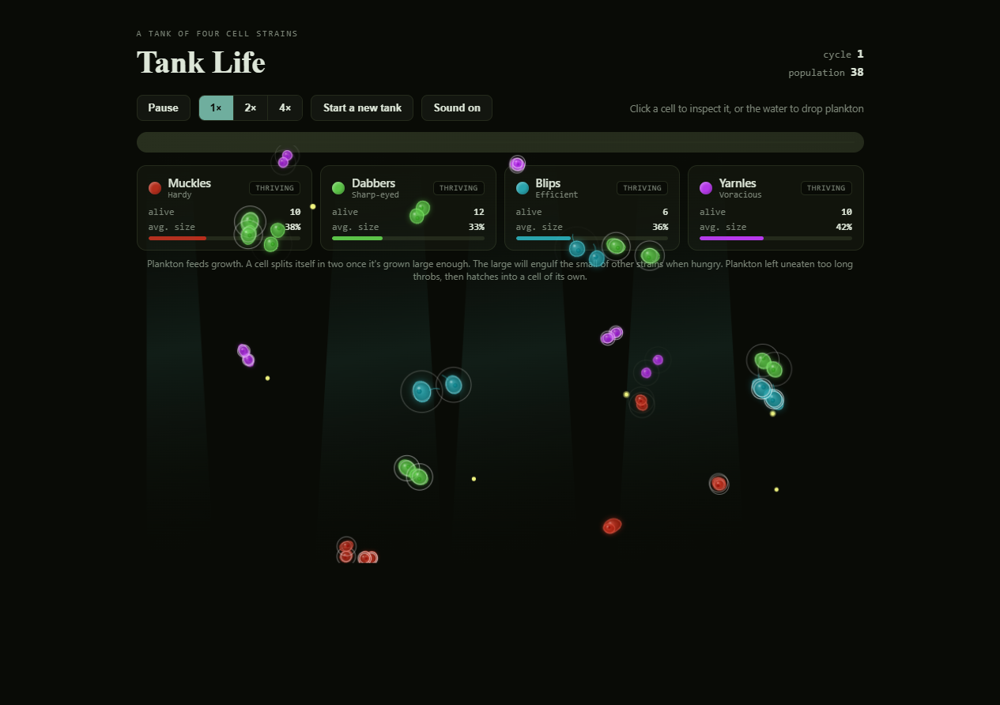

# Tank Life

A browser aquarium ecosystem simulation — a single self-contained HTML file, canvas-rendered, no build step and no external libraries.

**Live demo:** https://claude.ai/code/artifact/a46e0126-9633-4a4b-b3d6-4e4043d5464a



## What it is

Each tank spawns 4 "strains" of cell-like creatures, one per fixed behavior role:

- **Fast breeder** — reproduces quickly, stays small
- **All-rounder** — balanced stats
- **Apex predator** — large, preys on smaller strains
- **Evader** — fast, hard to catch

Every strain's numeric stats, name, color, and visual silhouette (tail / bulge / spiked hide / motion streak) are randomized independently each time a tank resets, so no two tanks look or play the same — only the underlying role identity stays stable across resets.

Creatures drift around eating plankton to grow, reproduce via mitosis once they've stored enough energy (splitting in two at any size, not just at maturity), and larger creatures hunt smaller creatures of other strains. Plankton left uneaten too long hatches into a new creature. Population is capped (currently 400) purely for performance, since the simulation is O(n²) per tick.

Other features:
- Click a creature to open an inspector panel with its live stats
- Random "zoomie" speed bursts
- Synthesized Web Audio sound effects (no audio files) with a mute toggle
- A per-role track-record history that persists across tank resets via `localStorage`
- Light/dark theming

## Running it

It's a single HTML file with no dependencies — open [tank-life.html](tank-life.html) directly in a browser, or serve the directory with any static file server:

```bash
python -m http.server 8000
```

Then visit `http://localhost:8000/tank-life.html`.

## Tech notes

- No external audio/image assets: all sound is synthesized via Web Audio oscillators, and all visuals are canvas-drawn shapes/gradients.
- Everything lives in one file: HTML, CSS, and JS are not split into separate assets.
